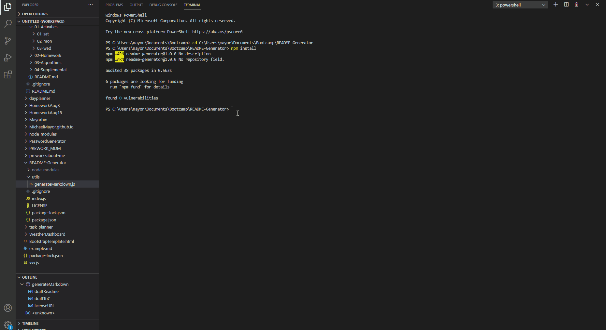

# README Generator

### Table of Contents

  * [Description](#description)
  * [Installation](#installation)
  * [Usage](#usage)
  * [License](#license)
 
## Description 
 
 
This porject can be used to generate a quality README file for any Github hosted coding project. This is a command line application using Node.js to generate a README file using minimal input from the project author. This README and the ExampleREADME.md were both generated using the application.
      
## Installation
      
First run npm install to install the package dependencies that this program requires. Then use the command 'node index.js' to run the application.
      
## Usage 

      
When run, the application will prompt you for details about your project to populate the README with. It will then generate a file using those responses and some information fetched from your github profile.
      
## License
      
MIT License

---
    
## Questions?
   
GitHub: [@MichaelMayor](https://api.github.com/users/MichaelMayor)
